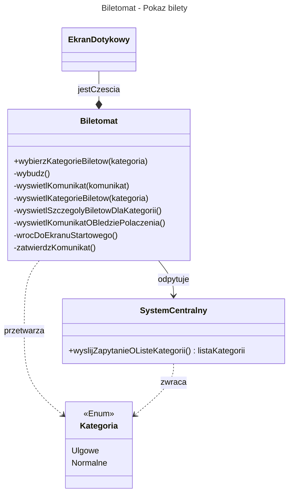

```mermaid
---
title: Biletomat - Pokaz bilety
---
classDiagram
    class EkranDotykowy {
    }

    class Kategoria {
        <<Enum>>
        Ulgowe
        Normalne
    }

    class Biletomat {
        +wybierzKategorieBiletow(kategoria)
        -wybudz()
        -wyswietlKomunikat(komunikat)
        -wyswietlKategorieBiletow(kategoria)
        -wyswietlSzczegolyBiletowDlaKategorii()
        -wyswietlKomunikatOBledziePolaczenia()
        -wrocDoEkranuStartowego()
        -zatwierdzKomunikat()
    }

    class SystemCentralny {
        +wyslijZapytanieOListeKategorii() listaKategorii
    }

    Biletomat --> SystemCentralny : odpytuje
    EkranDotykowy --* Biletomat : jestCzescia
    Biletomat ..> Kategoria : przetwarza
    SystemCentralny ..> Kategoria : zwraca
```
