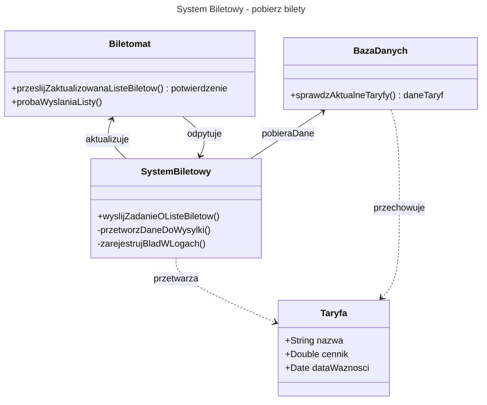

```mermaid
---
title: System Biletowy - pobierz bilety
---
classDiagram
    class Biletomat{
        +przeslijZaktualizowanaListeBiletow() potwierdzenie
        +probaWyslaniaListy()
    }
    class SystemBiletowy{
        +wyslijZadanieOListeBiletow()
        -przetworzDaneDoWysylki()
        -zarejestrujBladWLogach()

    }
    class BazaDanych{
        +sprawdzAktualneTaryfy() daneTaryf
    }

    class Taryfa {
        +String nazwa
        +Double cennik
        +Date dataWaznosci
    }
    SystemBiletowy <-- Biletomat : odpytuje
    Biletomat <-- SystemBiletowy : aktualizuje
    BazaDanych <-- SystemBiletowy : pobieraDane
    SystemBiletowy ..> Taryfa : przetwarza
    BazaDanych ..> Taryfa : przechowuje
```
