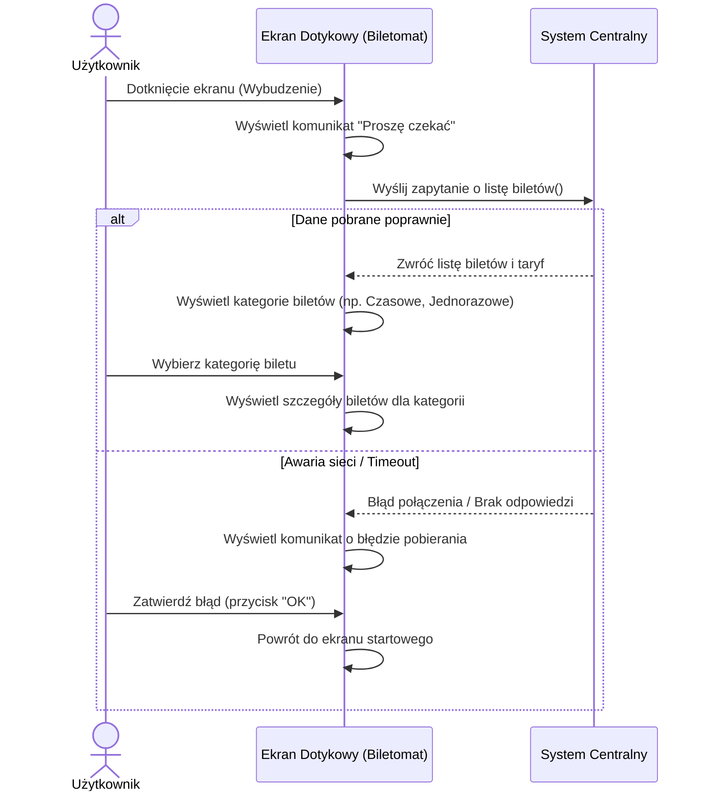

```mermaid
sequenceDiagram
    actor U as Użytkownik
    participant E as Ekran Dotykowy (Biletomat)
    participant S as System Centralny

    U->>E: Dotknięcie ekranu (Wybudzenie)
    E->>E: Wyświetl komunikat "Proszę czekać"
    E->>S: Wyślij zapytanie o listę biletów()
    
    alt Dane pobrane poprawnie
        S-->>E: Zwróć listę biletów i taryf
        E->>E: Wyświetl kategorie biletów (np. Czasowe, Jednorazowe)
        
        U->>E: Wybierz kategorię biletu
        E->>E: Wyświetl szczegóły biletów dla kategorii
        
    else Awaria sieci / Timeout
        S-->>E: Błąd połączenia / Brak odpowiedzi
        E->>E: Wyświetl komunikat o błędzie pobierania
        
        U->>E: Zatwierdź błąd (przycisk "OK")
        E->>E: Powrót do ekranu startowego
    end
```