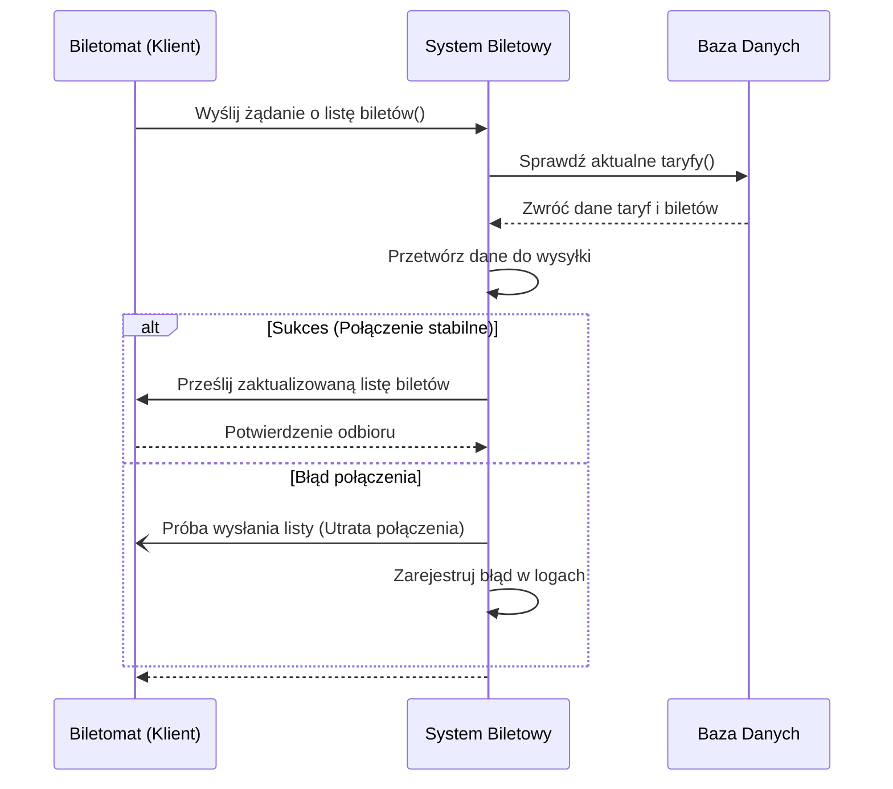

```mermaid
sequenceDiagram
    participant B as Biletomat (Klient)
    participant S as System Biletowy
    participant DB as Baza Danych

    B->>S: Wyślij żądanie o listę biletów()
    
    S->>DB: Sprawdź aktualne taryfy()
    DB-->>S: Zwróć dane taryf i biletów
    
    S->>S: Przetwórz dane do wysyłki
    
    alt Sukces (Połączenie stabilne)
        S->>B: Prześlij zaktualizowaną listę biletów
        B-->>S: Potwierdzenie odbioru
    else Błąd połączenia
        S-)B: Próba wysłania listy (Utrata połączenia)
        S->>S: Zarejestruj błąd w logach
    end

    S-->>B: 
```