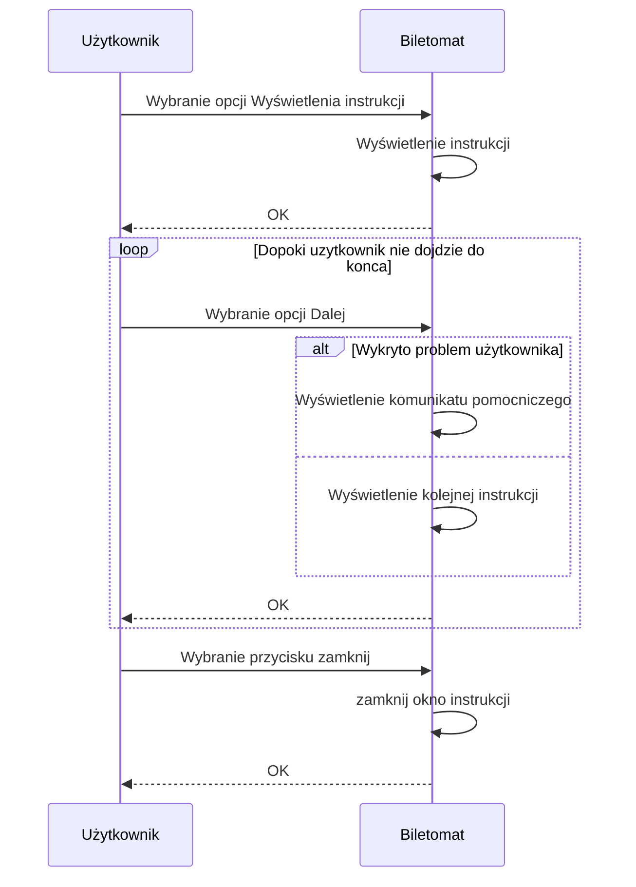

```mermaid
sequenceDiagram
    participant U as Użytkownik
    participant B as Biletomat

    U ->> B: Wybranie opcji Wyświetlenia instrukcji
    B ->> B: Wyświetlenie instrukcji
    B -->> U: OK
    loop Dopoki uzytkownik nie dojdzie do konca
        U ->> B: Wybranie opcji Dalej
        alt Wykryto problem użytkownika
            B ->> B: Wyświetlenie komunikatu pomocniczego
        else
            B ->> B: Wyświetlenie kolejnej instrukcji
        end
        B -->> U: OK
    end

    U ->> B: Wybranie przycisku zamknij
    B ->> B: zamknij okno instrukcji
    B -->> U: OK
```
