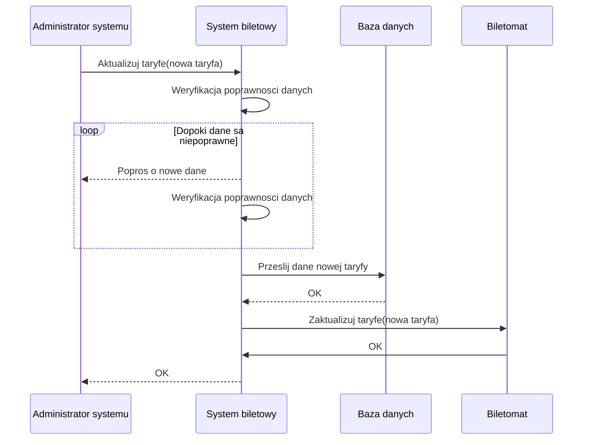

```mermaid
sequenceDiagram
     participant A as Administrator systemu
    participant S as System biletowy
    participant B as Baza danych
    participant Bil as Biletomat

    A ->> S: Aktualizuj taryfe(nowa taryfa)
    S ->> S: Weryfikacja poprawnosci danych
    loop Dopoki dane sa niepoprawne
        S -->> A: Popros o nowe dane
        S ->> S: Weryfikacja poprawnosci danych
    end
    S ->> B: Przeslij dane nowej taryfy
    B -->> S: OK
    S ->> Bil: Zaktualizuj taryfe(nowa taryfa)
    Bil ->> S: OK
    S -->> A: OK
```
