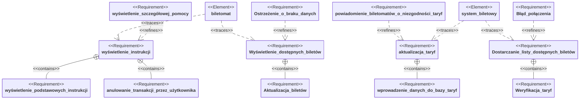

```mermaid
    requirementDiagram

    element biletomat {
    }

    requirement wyświetlenie_instrukcji {
    }

    requirement wyświetlenie_podstawowych_instrukcji {
    }

    requirement wyświetlenie_szczegółowej_pomocy {
    }

    requirement anulowanie_transakcji_przez_użytkownika {
    }

    requirement Wyświetlenie_dostępnych_biletów {
    }

    requirement Ostrzeżenie_o_braku_danych {
    }
    requirement Aktualizacja_biletów {
    }

    biletomat - traces -> Wyświetlenie_dostępnych_biletów
    biletomat - traces -> wyświetlenie_instrukcji
    Wyświetlenie_dostępnych_biletów - contains -> Aktualizacja_biletów
    Wyświetlenie_dostępnych_biletów <- refines - Ostrzeżenie_o_braku_danych
    wyświetlenie_instrukcji - contains -> wyświetlenie_podstawowych_instrukcji
    wyświetlenie_instrukcji - contains -> anulowanie_transakcji_przez_użytkownika
    wyświetlenie_instrukcji <- refines - wyświetlenie_szczegółowej_pomocy

    element system_biletowy {
    }

    requirement aktualizacja_taryf {
    }

    requirement wprowadzenie_danych_do_bazy_taryf {
    }

    requirement powiadomienie_biletomatów_o_niezgodności_taryf {
    }
    requirement Dostarczanie_listy_dostępnych_biletów {
    }
    requirement Weryfikacja_taryf {
    }
    requirement Błąd_połączenia {
    }

    aktualizacja_taryf - contains -> wprowadzenie_danych_do_bazy_taryf
    aktualizacja_taryf <- refines - powiadomienie_biletomatów_o_niezgodności_taryf
    system_biletowy - traces -> aktualizacja_taryf
    system_biletowy - traces -> Dostarczanie_listy_dostępnych_biletów
    Dostarczanie_listy_dostępnych_biletów - contains -> Weryfikacja_taryf
    Dostarczanie_listy_dostępnych_biletów <- refines - Błąd_połączenia
```