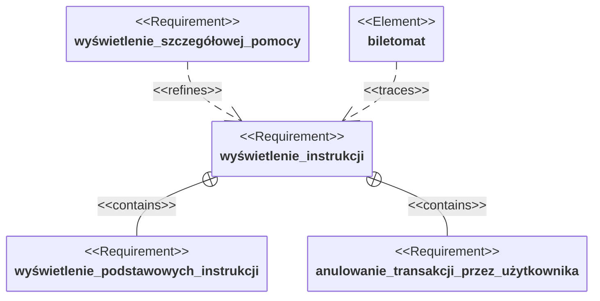

```mermaid
    requirementDiagram

    element biletomat {
    }

    requirement wyświetlenie_instrukcji {
    }

    requirement wyświetlenie_podstawowych_instrukcji {
    }

    requirement wyświetlenie_szczegółowej_pomocy {
    }

    requirement anulowanie_transakcji_przez_użytkownika {
    }

    wyświetlenie_instrukcji - contains -> wyświetlenie_podstawowych_instrukcji
    wyświetlenie_instrukcji - contains -> anulowanie_transakcji_przez_użytkownika
    wyświetlenie_instrukcji <- refines - wyświetlenie_szczegółowej_pomocy
    biletomat - traces -> wyświetlenie_instrukcji
```